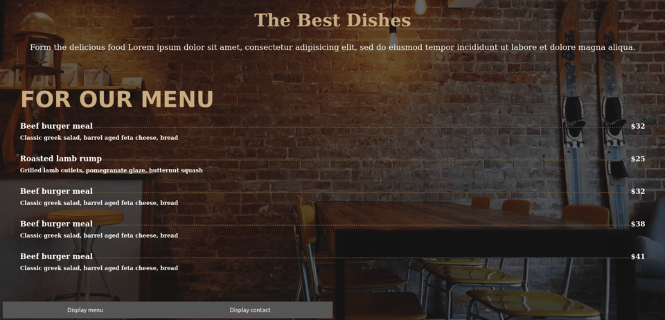

# Restaurant page

The propouse of this project is to use the  [DOM manipulation](https://www.w3schools.com/js/js_htmldom.asp) by dynamically rendering a simple restaurant homepage, only using JavaScript to generate the entire contents of the website!

    

## Built With

- HTML
- CSS
- JavaScript
- WebPack

## Live Demo

## Getting Started

To get a local copy up and running follow these simple example steps.

### Prerequisites

Download the project with this [link](https://github.com/JuanPabloGil/restaurant-page/archive/dev.zip) or run the next command

    $ git clone https://github.com/JuanPabloGil/restaurant-page.git

### Usage

- Open **index.html** file with your favorite browser. It's inside the project's root directory.
- That's it. Let's start playing Tic Tac Toe.

## Author

👤 **Juan Pablo Gil**

- [GitHub](https://github.com/JuanPabloGil )
- [@LinkedIn](https://www.linkedin.com/in/juan-pablo-gil-1321a515a/)
- jpablomgil@gmail.com

## 🤝 Contributing

Contributions, issues and feature requests are welcome!

Feel free to check the [issues page](https://github.com/JuanPabloGil/restaurant-page/issues).

## Show your support

Give a ⭐️ if you like this project!

## 📝 License

This project is [MIT]() licensed.
